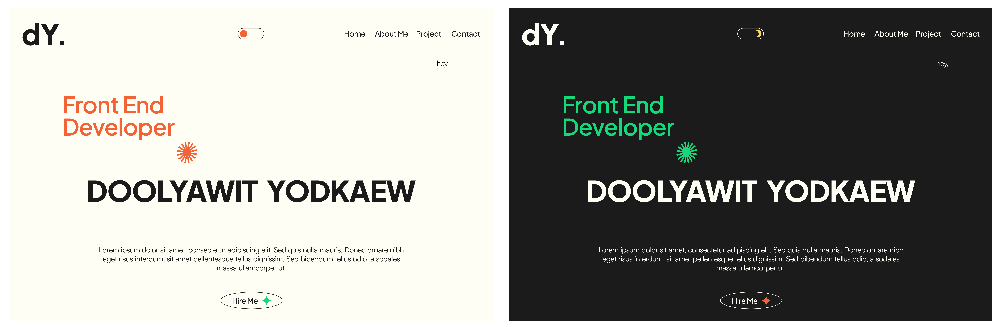

## Portfolio Website

This repository contains the code and assets for my personal portfolio website. The portfolio website showcases my skills, projects, and achievements in a visually appealing and user-friendly manner.

## Available Sites

- https://diwx.20cnx.xyz

## Features

- Home page with a brief introduction and overview of my expertise.
- Portfolio section showcasing my selected projects with descriptions, screenshots, and links.
- About Me section providing more details about my background, education, and work experience.
- Skills section highlighting my technical skills and proficiency.
- Contact Me section with a contact form for inquiries and collaboration opportunities.
- Responsive design to ensure optimal viewing experience on various devices.

## Technologies Used

- Next.js, React, and TypeScript for front-end development.
- Tailwindcss framework for responsive design and layout.
- Git for version control and collaboration.
- Deployed via docker container on AWS EC2.